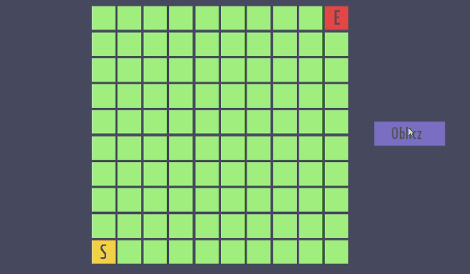

# AStarPath
an example of a star algorithm for pathfinding

## Table of contents
* [General info](#general-info)
* [Technologies](#technologies)
* [Scripts](#scripts)
* [Preview](#preview)

## General info
It is interactive grid map where grids represents different basis (normal | hard | water | wall). 
All those basis have different cost while moving. 
Player can change those grids and calculate the shortest path from start point to end point.

#### Cost Rules:
* normal to normal = **cost x1**   
* normal to hard = **cost x2**
* normal to water = **cost x2** 
* hard to normal = **cost x1**
* hard to hard = **cost x2** 
* hard to water = **cost x4**
* water to normal = **cost x2**
* water to hard = **cost x4**
* water to water = **cost x1**
## Technologies 
* Unity version 2019.4.12

## Scripts
### Grid Controller
shows grid map and modify them
### PathBox
keep data about all grids
### AStarAlgorithm
algorithm to calculate the path

## Preview

